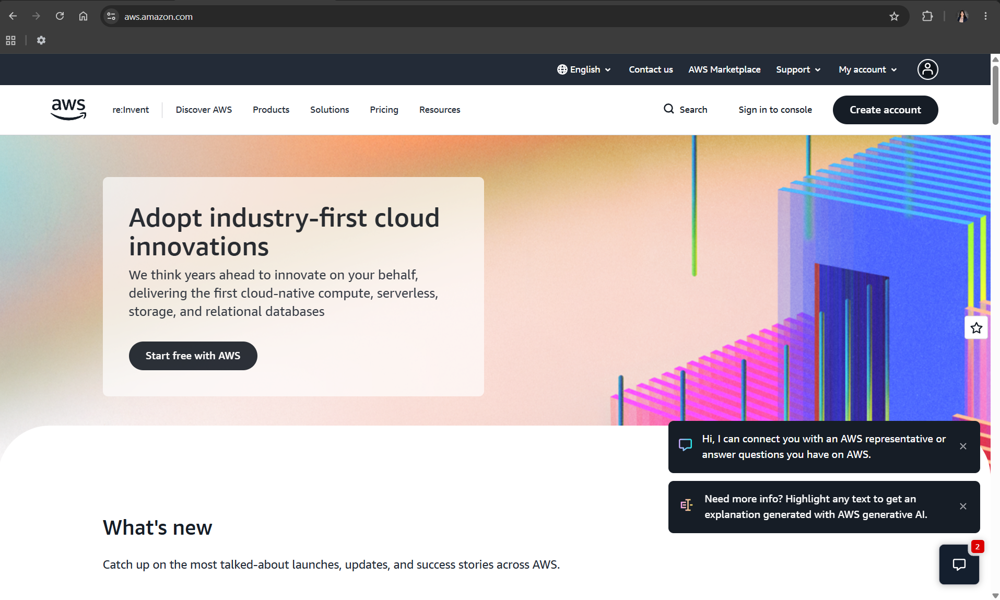

# Amazon Web Services (AWS)

## Brief Overview

Amazon Web Services (AWS) is Amazon's cloud computing platform that was launched in 2006. It provides a wide range of cloud services that help businesses run applications, store data, and build online services without relying on physical servers.

## Global Infrastructure

AWS has one of the largest cloud infrastructures in the world. It operates multiple Regions and Availability Zones across many countries, helping businesses improve performance and reliability by hosting services closer to their users.

## Cloud Management Console

The AWS Management Console is a web-based dashboard where users can create, monitor, and manage cloud resources such as virtual machines, storage, databases, and networking services.

## Four Core Services

| Service | Purpose |
|---------|---------|
| Amazon EC2 | Virtual machines |
| Amazon S3 | Object storage |
| Amazon RDS | Managed relational database |
| Amazon VPC | Private cloud networking |

## Three Advantages

- Offers a broad range of cloud services.
- Provides flexible scaling for growing businesses.
- Has a reliable global infrastructure with high availability.

## Typical Enterprise Use Cases

- Web and mobile application hosting
- Data backup and disaster recovery
- Enterprise applications
- Large-scale cloud infrastructure

## Screenshot

> Insert your screenshot of the official AWS homepage or AWS Management Console here.

## References

- Amazon Web Services Official Documentation
- https://aws.amazon.com/
