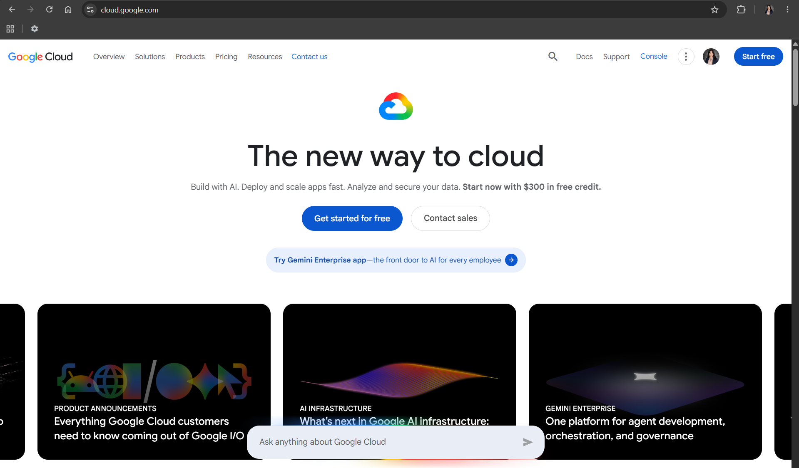

# Google Cloud Platform (GCP)

## Brief Overview

Google Cloud Platform (GCP) is Google's cloud computing platform launched in 2008. It offers cloud services for computing, storage, networking, databases, artificial intelligence, and machine learning, making it a strong choice for modern cloud-native applications.

## Global Infrastructure

GCP operates data centers across multiple regions worldwide and uses Google's high-speed global network. This infrastructure helps deliver fast performance and reliable cloud services to users around the world.

## Cloud Management Console

The Google Cloud Console is a web-based dashboard that allows users to create, monitor, and manage cloud resources such as virtual machines, storage, databases, and AI services.

## Four Core Services

| Service | Purpose |
|---------|---------|
| Compute Engine | Virtual machines |
| Cloud Storage | Object storage |
| Cloud SQL | Managed SQL database |
| Google Kubernetes Engine (GKE) | Kubernetes management |

## Three Advantages

- Strong AI and machine learning capabilities.
- Industry-leading Kubernetes platform.
- Fast and reliable global network infrastructure.

## Typical Enterprise Use Cases

- AI and machine learning projects
- Big data analytics
- Containerized applications
- Cloud-native software development

## Screenshot

## References

- Google Cloud Official Documentation
- https://cloud.google.com/
